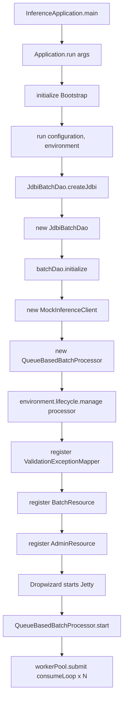
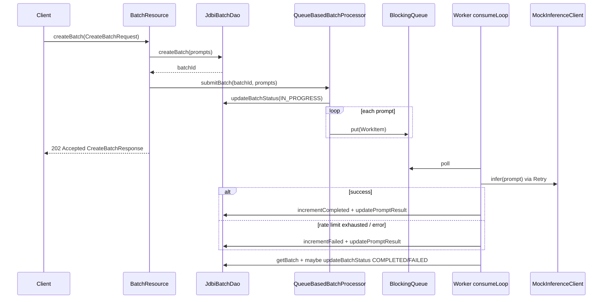

# Batch Inference Service

Dropwizard 4 + Java 21 service that accepts large AI prompt batches, processes them concurrently with a bounded worker pool, retries simulated HTTP 429 responses with Resilience4j, and exposes batch status over REST.

## Quickstart

```bash
mvn clean install
java -jar target/batch-inference-service-1.0.0-SNAPSHOT.jar server config.yml
```

The server listens on `http://127.0.0.1:8080` (admin port `8081`). Default `config.yml` uses file-backed H2 in PostgreSQL compatibility mode so you can run locally without Docker.

### Optional PostgreSQL

```bash
docker compose up -d
```

Then point `config.yml` at Postgres:

```yaml
dbUrl: jdbc:postgresql://localhost:5432/batchdb
dbUser: batchuser
dbPassword: batchpass
```

## API

### Create a batch

```bash
curl -s -X POST http://127.0.0.1:8080/v1/batches \
  -H 'Content-Type: application/json' \
  -d '{"prompts":["hello","world"]}'
```

Returns **202 Accepted** with a `batchId` immediately while work continues in the background.

### Check batch status

```bash
curl -s http://127.0.0.1:8080/v1/batches/<batch-id>
```

Statuses: `PENDING` → `IN_PROGRESS` → `COMPLETED` or `FAILED`.

### Admin DB inspect

```bash
curl -s http://127.0.0.1:8080/admin/db
```

## Concurrency model

- Fixed worker pool sized by `maxConcurrentWorkers` (Dropwizard `Managed` lifecycle).
- Prompts are enqueued on a bounded `LinkedBlockingQueue` (`queueCapacity`, default 1000) using blocking `put` so prompts are not dropped.
- Workers pull work in a consumer loop — the service never starts one thread per prompt.

## Resilience4j retry

Each inference call is wrapped in a Resilience4j `Retry` registry entry configured from YAML:

- `maxRetries` — max attempts per prompt (includes the first try)
- `retryInitialDelayMs` — initial backoff
- multiplier `2.0` with randomized jitter (`retryJitterFactor`) via `IntervalFunction.ofExponentialRandomBackoff`
- retries only on `InferenceRateLimitException` (mock HTTP 429)

After attempts are exhausted the prompt is marked failed and persisted in `batch_results`.

## Tests

```bash
mvn clean test
```

Coverage includes non-blocking ingestion, H2-backed completion, and Resilience4j retry exhaustion / recovery scenarios.

## Code flow: startup to API

Live path only. Legacy classes (`InferenceController`, `InferenceService`, `BatchHttpHandler`, `BatchProcessorService`) exist but are **not** registered in `InferenceApplication`.

### Startup



| Step | Class | Method |
|------|--------|--------|
| Entry | `InferenceApplication` | `main` → `run(args)` |
| Config load | `BatchProcessorConfiguration` | getters (`getDbUrl`, `getMaxConcurrentWorkers`, …) |
| Wire-up | `InferenceApplication` | `run(configuration, environment)` |
| DB | `JdbiBatchDao` | `createJdbi` → ctor → `initialize` |
| Mock model | `MockInferenceClient` | ctor |
| Workers | `QueueBasedBatchProcessor` | ctor (builds queue + Resilience4j `Retry`) |
| Lifecycle | Dropwizard → `QueueBasedBatchProcessor` | `start` → `consumeLoop` (one thread per worker) |
| HTTP | Jersey | registers `BatchResource`, `AdminResource`, `ValidationExceptionMapper` |

### API: create batch `POST /v1/batches`



| Step | Class | Method |
|------|--------|--------|
| HTTP | `BatchResource` | `createBatch` |
| Persist | `JdbiBatchDao` | `createBatch` → SQL `insertBatch` |
| Enqueue | `QueueBasedBatchProcessor` | `submitBatch` → `updateBatchStatus` → `queue.put` |
| Response | `BatchResource` | `Response.accepted(CreateBatchResponse)` |
| Async | `QueueBasedBatchProcessor` | `consumeLoop` → `process` |
| Infer | `MockInferenceClient` | `infer` (latency + optional 429) |
| Retry | Resilience4j via `process` | retries only on `InferenceRateLimitException` |
| Persist result | `JdbiBatchDao` | `incrementCompleted` / `incrementFailed`, `updatePromptResult` |
| Finish | `QueueBasedBatchProcessor` | `evaluateBatchCompletion` → `updateBatchStatus` |

Validation failures (`@Valid CreateBatchRequest`) go to `ValidationExceptionMapper.toResponse` → `400`.

### API: status `GET /v1/batches/{batchId}`

| Step | Class | Method |
|------|--------|--------|
| HTTP | `BatchResource` | `getBatchStatus` |
| Lookup | `JdbiBatchDao` | `getBatch` |
| Response | `BatchStatusResponse` | built from `BatchRecord` fields |

### API: admin `GET /admin/db`

| Step | Class | Method |
|------|--------|--------|
| HTTP | `AdminResource` | `inspect` |
| Data | `JdbiBatchDao` | `listBatches`, `listBatchResults` |

### Not on the live path

These are compiled/tested but **not** wired in `InferenceApplication.run`:

- `InferenceController` / `InferenceService` / `MockRateLimitedInferenceClient`
- `BatchHttpHandler` (raw JDK `HttpHandler`)
- `BatchProcessorService` (older thread-pool processor; tests still use it)

Live stack: **`InferenceApplication` → Jersey resources → `JdbiBatchDao` + `QueueBasedBatchProcessor` → `MockInferenceClient`**.

### Try the flow locally

**1. Build and start**

```bash
mvn clean package -DskipTests
java -jar target/batch-inference-service-1.0.0-SNAPSHOT.jar server config.yml
```

Wait until Dropwizard logs that the application connector is listening on `http://127.0.0.1:8080` (admin on `8081`). Startup runs `InferenceApplication.run` → DB init → worker `consumeLoop` threads.

**2. Create a batch** (`BatchResource.createBatch` → enqueue → async `process`)

```bash
curl -s -X POST http://127.0.0.1:8080/v1/batches \
  -H 'Content-Type: application/json' \
  -d '{"prompts":["hello","world","batch inference"]}'
```

Example response (**202 Accepted**):

```json
{
  "batchId": "<uuid>",
  "status": "IN_PROGRESS",
  "message": "Batch accepted for processing"
}
```

Copy the `batchId` for the next calls.

**3. Poll status** (`BatchResource.getBatchStatus`)

```bash
curl -s http://127.0.0.1:8080/v1/batches/<batch-id>
```

Repeat until `status` is `COMPLETED` or `FAILED`. Fields `completed` / `failed` increment as workers finish each prompt.

**4. Inspect DB state** (`AdminResource.inspect`)

```bash
curl -s http://127.0.0.1:8080/admin/db
```

Shows recent batches and prompt-level results for the first listed batch.

**5. Optional: validation error path** (`ValidationExceptionMapper`)

```bash
curl -s -X POST http://127.0.0.1:8080/v1/batches \
  -H 'Content-Type: application/json' \
  -d '{"prompts":[]}'
```

Expect **400** with a validation error body (empty `prompts` fails `@NotEmpty`).
