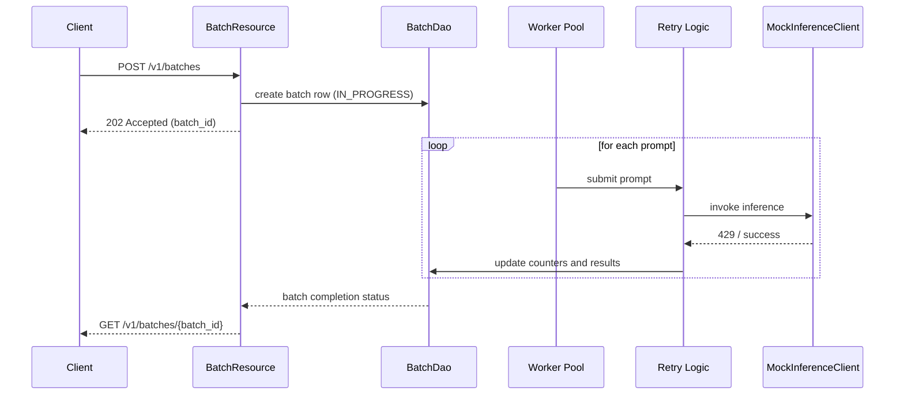

# Architecture

```mermaid
sequenceDiagram
    participant Client
    participant API as BatchResource
    participant DB as BatchDao
    participant Pool as Worker Pool
    participant Retry as Retry Logic
    participant Inference as MockInferenceClient

    Client->>API: POST /v1/batches
    API->>DB: create batch row (IN_PROGRESS)
    API-->>Client: 202 Accepted (batch_id)
    loop for each prompt
        Pool->>Retry: submit prompt
        Retry->>Inference: invoke inference
        Inference-->>Retry: 429 / success
        Retry->>DB: update counters and results
    end
    DB-->>API: batch completion status
    API-->>Client: GET /v1/batches/{batch_id}
```
