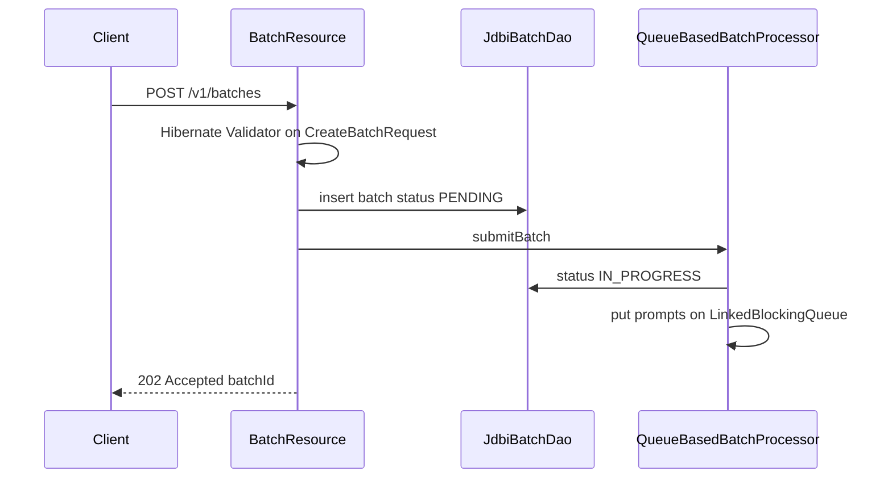
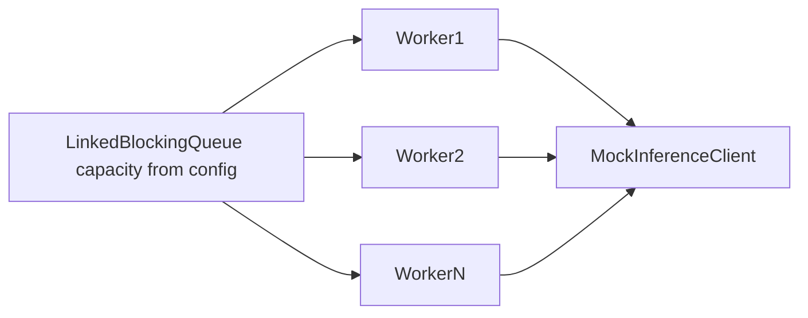
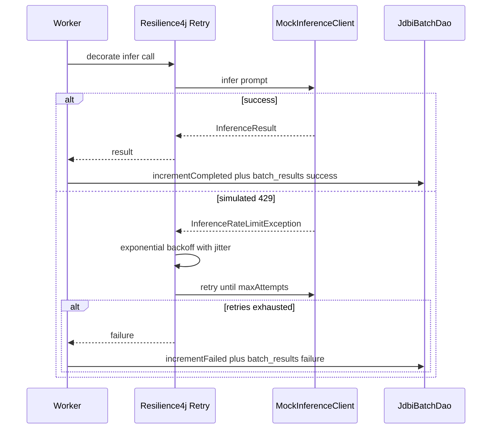
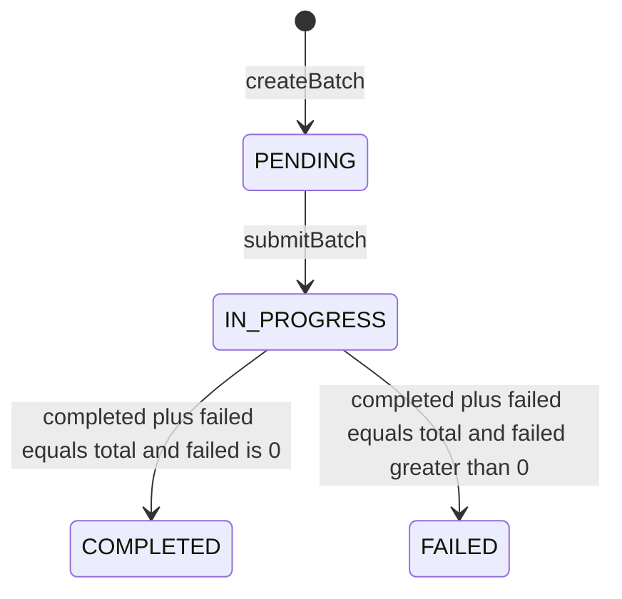

# Architecture

## 1. API ingestion and HTTP 202 acknowledgement

## 2. Bounded worker pool and shared queue

Workers are a fixed `ExecutorService` sized by `maxConcurrentWorkers` and started/stopped via Dropwizard `Managed` lifecycle. Consumers equal the pool size — never one thread per prompt.

## 3. Resilience4j retry on simulated HTTP 429

## 4. Batch completion state transition

